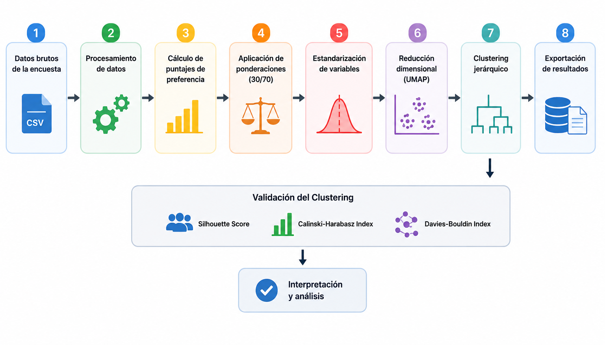
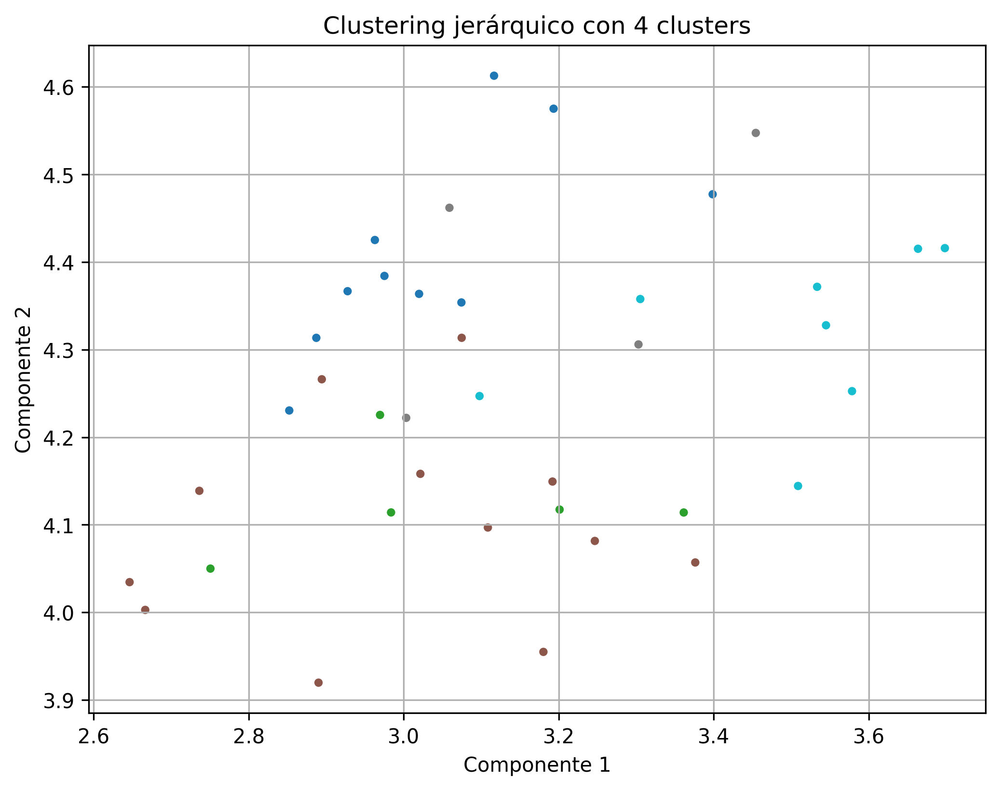
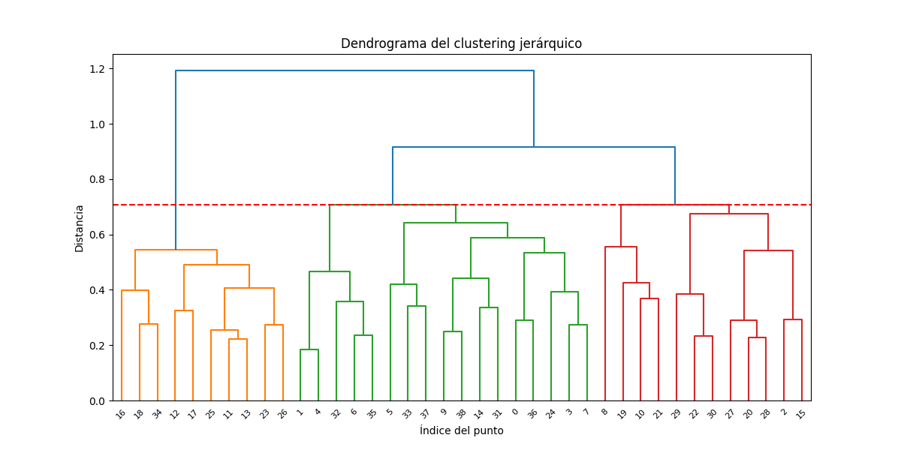
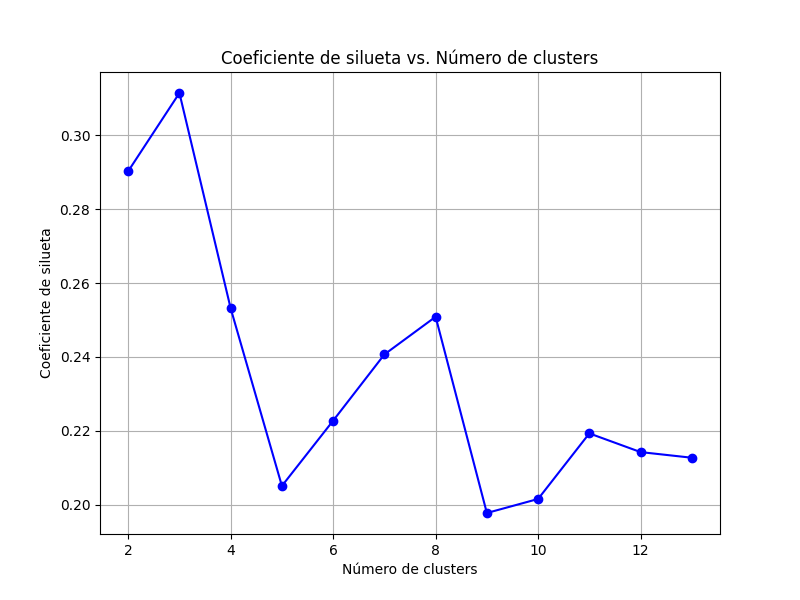

# Walkability Survey Processing

Python pipeline for processing, scoring, and clustering walkability perception survey data.

## Features

- Survey preprocessing
- Preference ranking normalization
- Weighted scoring system
- Socio-demographic encoding
- Dimensionality reduction with UMAP
- Hierarchical clustering
- Cluster validation metrics
- Automated CSV output generation

## Technologies

- Python
- pandas
- numpy
- scikit-learn
- scipy
- umap-learn
- matplotlib

## Methodology

Survey responses are transformed into normalized weighted scores
based on both:
- variable selection
- preference ranking

The weighting system used in this project was calibrated iteratively
during the clustering stage of the research workflow.

Different weighting combinations were evaluated to identify
configurations that produced better cluster separation
and consistency.

Clustering performance was assessed using:
- Silhouette Score
- Calinski-Harabasz Index
- Davies-Bouldin Index

The final configuration (30% selection / 70% ranking)
was chosen based on the overall clustering performance
across these metrics.

## Walkability Variables

| Variable | Description |
|---|---|
| swd | Sidewalk delimitation |
| ws | Sidewalk width |
| pedFlow | Pedestrian flow |
| pvQ | Pavement quality |
| pedInfr | Pedestrian infrastructure |
| Obstr | Sidewalk obstacles |
| Pres_pol_c | Presence of security elements (police, cameras) |
| Crime | Crime perception |
| Crashes | Traffic accidents |
| Lighting | Street lighting |
| Cs | Vehicle speed |
| ptStops | Public transport stops |
| Tcontrl | Traffic control |
| trFlow | Vehicular flow |
| crTime | Crossing time |
| trDens | Commercial land-use density |
| insDens | Institutional/administrative land-use density |
| ResDens | Residential land-use density |
| Aesthetics | Building aesthetics |
| Trees | Presence of trees |
| Block | Block length |
| noise | Noise level |
| StagH2o | Stagnant water |
| Slope | Street slope |
| AirPol | Air pollution |
| Cleanless | Street cleanliness |
| mpgaDens | Green/Parks/recreational areas density |

These variables represent perceived walkability-related factors evaluated by pedestrians through survey-based preference selection and ranking processes.

Participants prioritized variables according to perceived importance, allowing the construction of weighted preference profiles later used in clustering analysis.


## Project Workflow

1. Raw survey preprocessing
2. Preference score normalization
3. Weighted variable generation
4. Standardization of features
5. UMAP dimensionality reduction
6. Hierarchical clustering
7. Cluster validation using:
   - Silhouette Score
   - Calinski-Harabasz Index
   - Davies-Bouldin Index
8. Export of clustered datasets




## Clustering Workflow

The clustering pipeline includes:

1. Data standardization using `StandardScaler`
2. Dimensionality reduction using UMAP
3. Hierarchical clustering
4. Cluster quality evaluation using internal validation metrics

Hierarchical clustering was implemented using:
- average linkage
- Chebyshev distance metric


## Project Structure

```text
data/       -> input survey data
outputs/    -> processed datasets and clustering outputs
src/        -> processing and clustering scripts
```

## Scripts

### `survey_processing.py`

Processes raw survey responses and generates weighted
walkability-related variables.

### `clustering_analysis.py`

Performs:
- dimensionality reduction
- hierarchical clustering
- cluster validation
- result exportation

### `walkability_index.py`

This script derives cluster-specific walkability index functions based on previously computed clustering results.

It performs the following steps:

- Loads cluster-level aggregated preference data (mean values per variable)
- Normalizes variables within each cluster to obtain relative weights
- Differentiates between benefit-type and cost-type variables
- Applies inversion to cost variables using (1 - x) transformation

Constructs a linear composite index for each cluster:

CI_k(x) = Σ_j w_{k,j} * f_j(x)

Outputs symbolic expressions representing cluster-specific walkability utility functions

The resulting expressions describe distinct pedestrian perception profiles
and can be interpreted as cluster-specific utility functions for urban
walkability evaluation.

## Outputs

The project generates:
- processed survey datasets
- clustered datasets
- validation metrics
- clustering visualizations


## Example clustering visualization

The following figures were generated using a reduced sample dataset
included for demonstration and reproducibility purposes.

These visualizations illustrate the dimensionality reduction and
hierarchical clustering workflow used in the research pipeline.

### UMAP projection


### Hierarchical clustering


### Clustering validation

